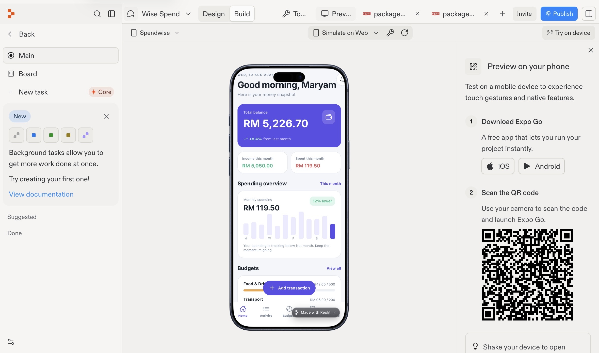
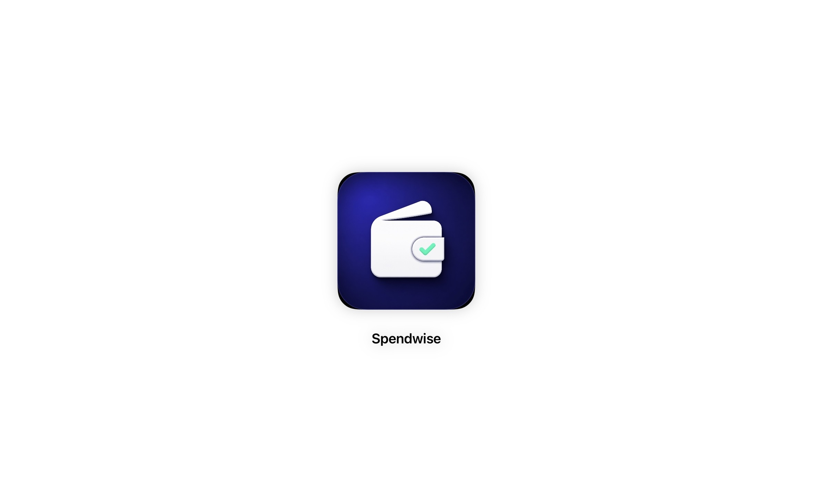
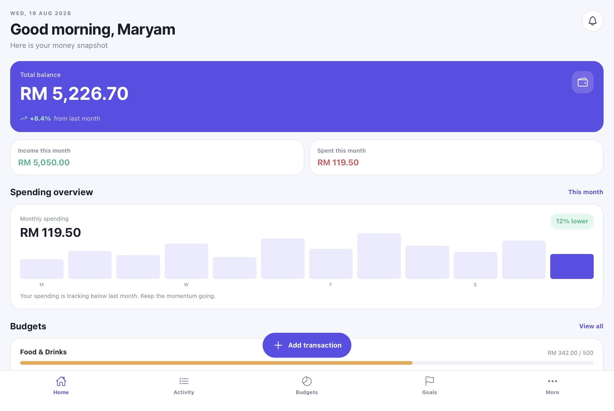
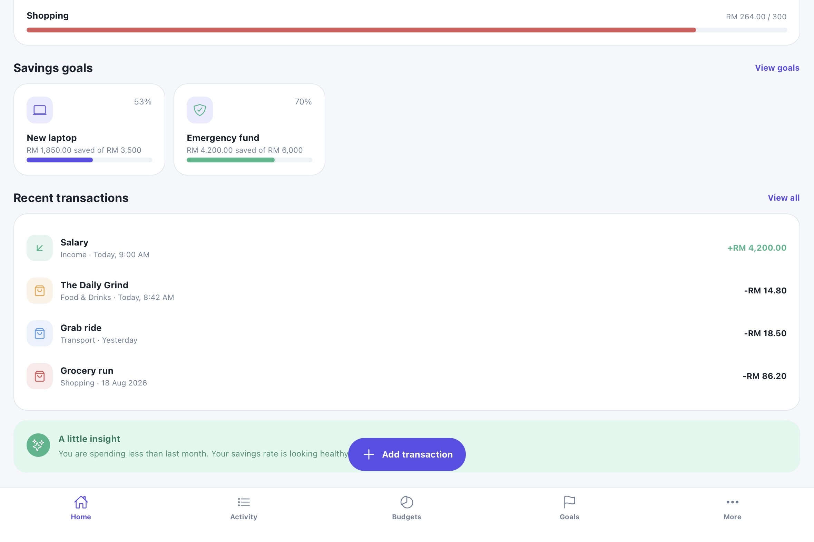
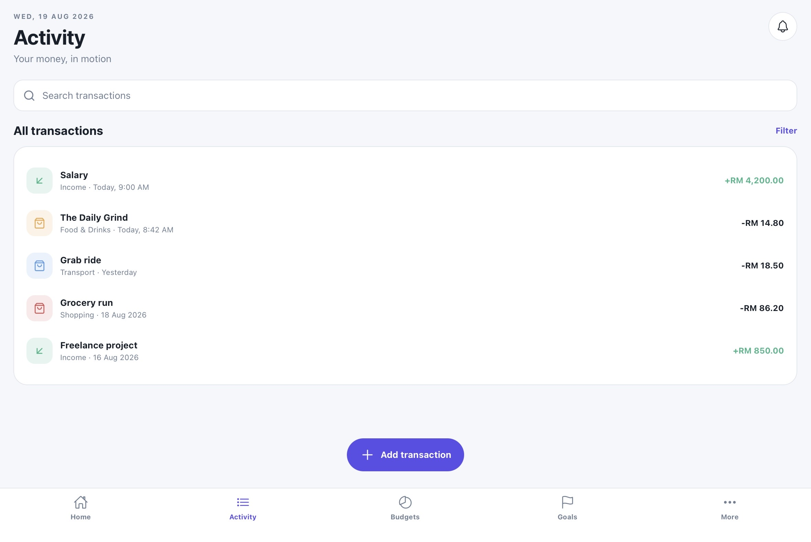
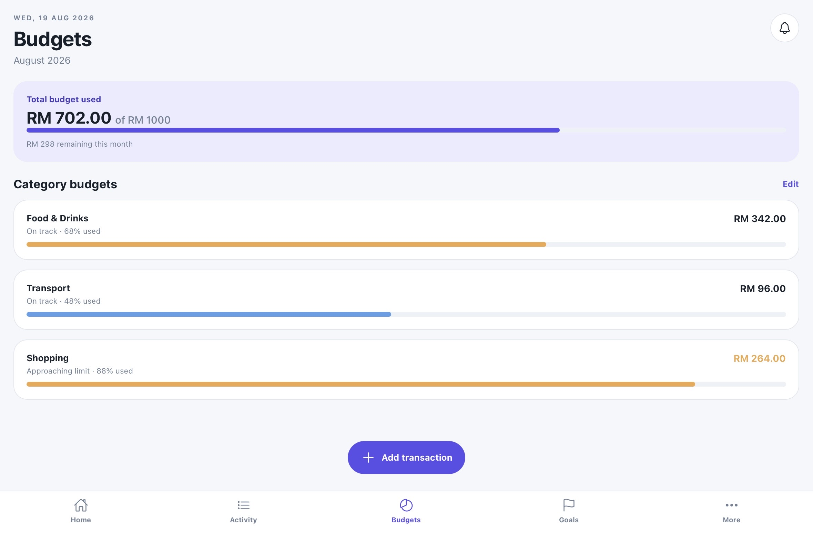
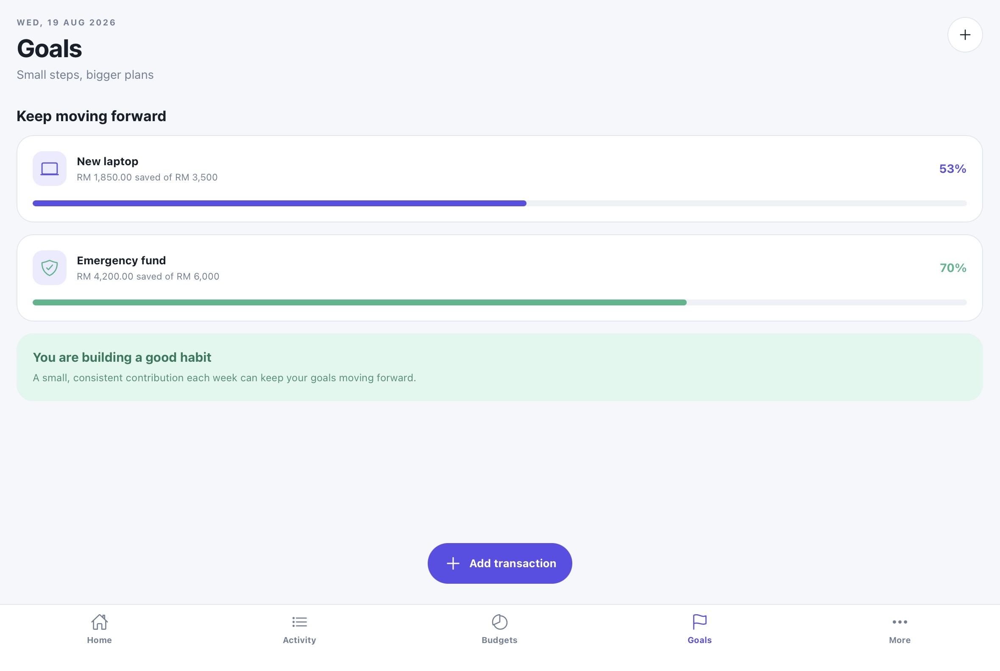
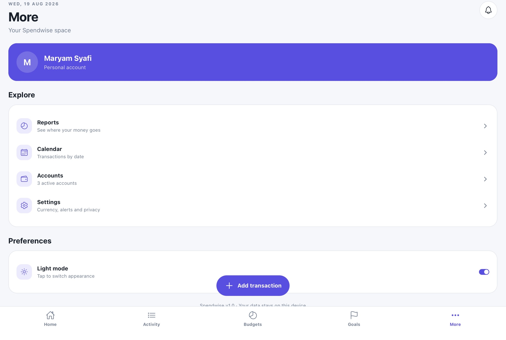
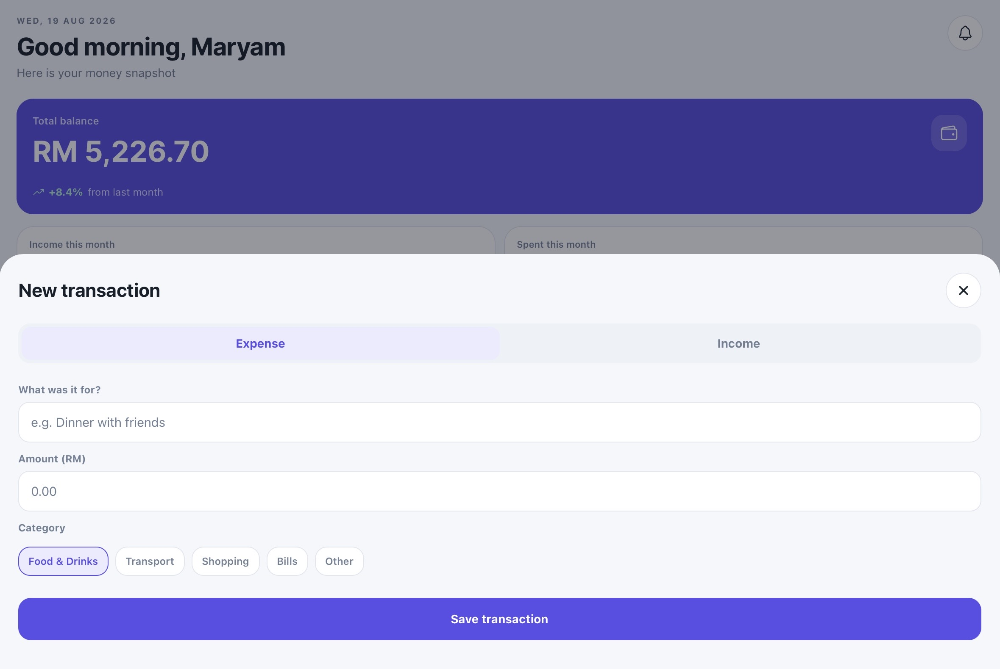
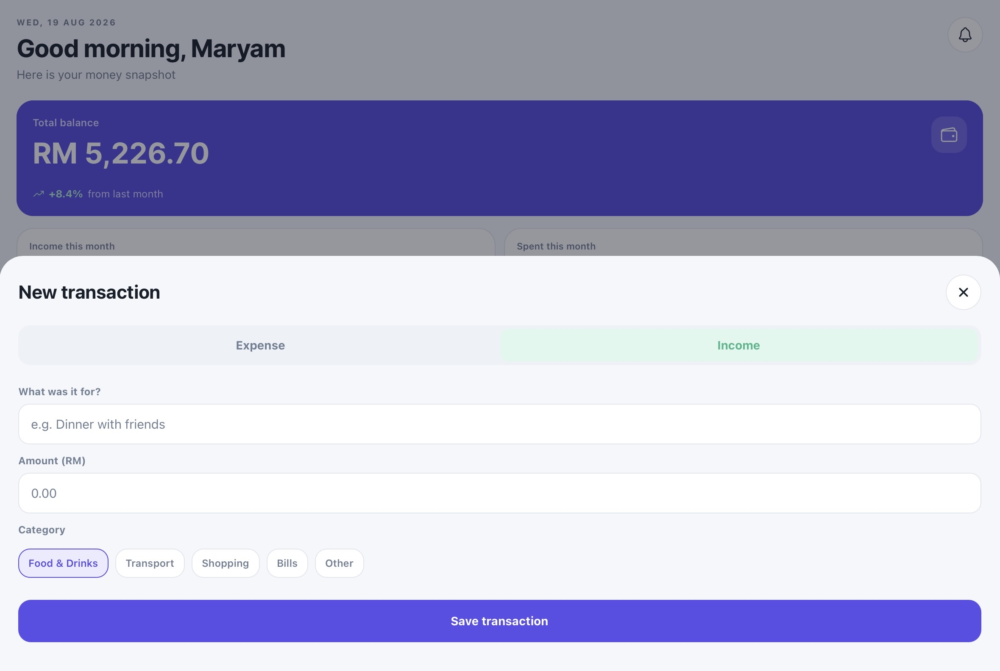

# 💜 SpendWise

> A personal finance web application designed to help users manage their money in one place.

**SpendWise is currently a work in progress.** The current version contains the initial application design and core features, with further improvements and functional updates planned.

***Notes:*** This is a free time mobile application that i made using **Replit** and are still under development which are yet to be published. The mobile application can be tried by scanning the barcode from **Build Screenshots** using **Expo Go**

---

## ✨ About

SpendWise is designed as a simple and modern personal finance tracker where users can manage their everyday finances without relying on multiple separate tools.

The application aims to allow users to:

- 💰 Track income and expenses
- 💳 Manage multiple accounts
- 🏷️ Organize transactions by category
- 📊 Understand spending habits
- 🎯 Set and track savings goals
- 💵 Create spending budgets
- 📅 View financial activity by date
- 🧾 Keep track of receipts
- 🔔 Receive useful financial reminders

The long-term goal is to develop SpendWise into a more complete personal finance platform rather than simply a basic expense tracker.

---

## 🎨 Design

SpendWise is designed with a **modern, clean and approachable financial-app style**.

The design aims to balance:

- A sleek and professional appearance
- Easy-to-read financial information
- A little color and personality
- Simple navigation
- Mobile-friendly layouts
- Practical rather than decorative features

The visual design is still being refined and may change during development.

---

## 📸 Screenshots
### Build

### Icon

### Home Page

### Home Page Part2

### Activity Page

### Budget Page

### Goals Page

### More Page

### New Expenses Transaction

### New Income Transaction

---

## 🚧 Current Status

**Work in Progress — 🚧 Active Development**

The current version is an early development version of SpendWise.

Some features, interactions and visual elements are still being improved. There may also be:

- UI inconsistencies
- Design issues
- Incomplete functionality
- Temporary data
- Bugs
- Features that are still being connected to persistent data

These will be addressed in future updates.

---

## 🛠️ Technology

The project is being developed using:

- **TypeScript**
- **HTML / CSS / JavaScript**
- **Replit**
- **pnpm**

Additional technologies and services may be introduced as development continues.

---

## 🗺️ Planned Improvements

Future updates will focus on making SpendWise a fully functional application rather than only a visual prototype.

### Version 1

- [ ] Complete user authentication
- [ ] Persistent user data
- [ ] Functional expense and income tracking
- [ ] Functional account management
- [ ] Functional budgets
- [ ] Functional savings goals
- [ ] Accurate financial calculations
- [ ] Functional reports and charts
- [ ] Receipt management
- [ ] Improved responsive design
- [ ] Bug fixes and UI improvements

### Future Versions

Potential future features include:

- Recurring expenses
- Subscription tracking
- Bill reminders
- Group expense splitting
- Shared travel budgets
- Trip planning
- AI-powered travel recommendations
- Money-owed tracking
- Payment reminders
- Additional financial tools

These features are ideas for future development and are not part of the current version.

---

## 🎓 Project Purpose

SpendWise is also a personal learning and portfolio project.

The project gives me an opportunity to develop practical experience with:

- Web application development
- UI/UX design
- Database management
- User authentication
- CRUD operations
- Data handling
- Responsive design
- Debugging
- Software development workflows
- AI-assisted development

Rather than building only a static interface, the long-term goal is to turn SpendWise into a genuinely usable application.

---

## 📌 Note

This repository represents an ongoing development project.

The design, features and underlying technology may change as the application continues to evolve.

More updates will be made as SpendWise moves from its initial prototype toward a fully functional application.

---

## 👩‍💻 Author

**Maryam**

Created as a personal software development and portfolio project.
